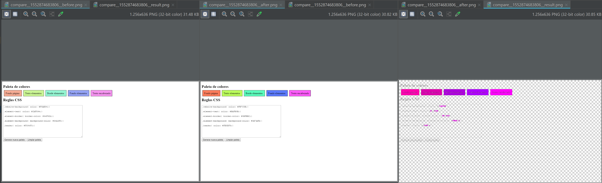

# Visual Regression Testing

para ejecutar el comparador se puede usar el commando `npm run compare`
```
npm install
npm run compare
```

[Random Colors Page](https://ir-taimal10.github.io/miso-4208-taller-6/randomColorsApp/)


<p align="center">
  
</p>

## Preguntas


1. ¿Ve usted algún problema con los screenshots tomados por Cypress al intentar hacer Visual Regression Testing?

Los screenshots que genera Cypress incluyen el área de logs de Cypress, lo cual puede generar pequeñas diferencias en una prueba de regresión visual.

2. ¿Qué información puedo obtener de una imagen al usar resembleJS y que significado tiene cada uno de los componentes de la respuesta?.

Con resembleJS es posible analizar imagenes de forma independiente: se obtienen los datos:

* Información de su color para cada uno de los componentes RGB,
* Nivel de color blanco y negro presente en la imagen medido en porcentaje
* Nivel de brillo de la imagen.

```javascript
{
    red: 100,
    green: 100,
    blue: 100,
    brightness: 100,
    alpha: 100,
    white: 100,
    black: 100
}
```


3. ¿Qué información puedo obtener al comparar dos imagenes?

Al comparar dos imagenes con ResembleJS, puedo obtener información de:

 * Dimensión,
 * Diferencia en las dimensiones,
 * Porcentage de diferencia,
 * Porcentage de diferencia aproximado,
 * Diferencia en los limites de la imagen,
 * Tiempo que tomo hacer el analisis.

```javascript
{
    "isSameDimensions" : true,
    "dimensionDifference" : {
        "width" : NumberInt(0),
        "height" : NumberInt(0)
    },
    "rawMisMatchPercentage" : 3.7820095486111107,
    "misMatchPercentage" : "3.78",
    "diffBounds" : {
        "top" : NumberInt(33),
        "left" : NumberInt(0),
        "bottom" : NumberInt(697),
        "right" : NumberInt(2069)
    },
    "analysisTime" : NumberInt(962)
}
```


4. ¿Qué opciones se pueden seleccionar al realizar la comparación?

Las opciones se pueden clasificar en 7 grupos:

* Ignorar: Nada, menos, colores, alpha etc.
* Tamaño: escalado u original.
* Color de diferencias
* Error por movimiento y localización
* Resaltado de similitudes opaco o transparente
* Caja de evaluación
* Caja para ignorar en la evaluación